# FixNest: Hostel Maintenance & Complaint Tracker

FixNest replaces WhatsApp messages and word-of-mouth with one place to report, assign, fix and track hostel problems
(broken fans, leaks, Wi-Fi, furniture). It was built for a single I2IT hostel, as a real, deployable app rather than a
demo.

- **Students** report a problem in a few taps, and follow it from *Submitted* to *Fixed*.
- **Maintenance staff** see exactly what is broken, where, who reported it and how urgent it is, and update progress.
- **The warden** runs the hostel day to day: sees everything at a glance, assigns work, and looks after students and staff.
- **The admin** runs the system: everything a warden can do, plus wardens, hostels, rooms and categories.

## See it

[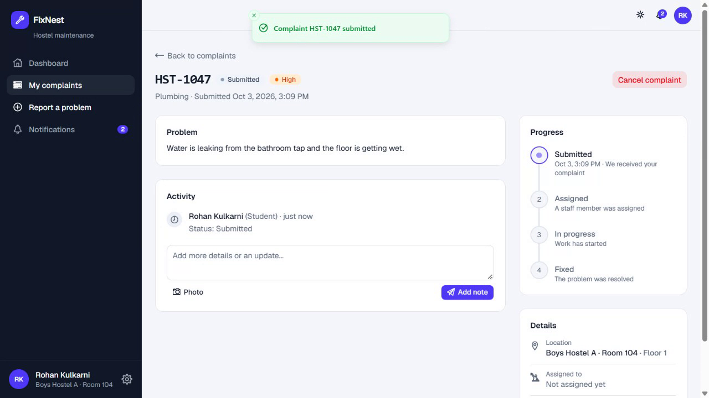](docs/demo/fixnest-demo.webm)

*Click the picture to watch (about a minute, no sound): a student reports a leak and tries to mark it Urgent, the admin
assigns it to the plumber, the plumber fixes it, and the student sees it fixed. All names, rooms and complaints in the
pictures and the video are made-up demo data.*

### For students

| | |
|---|---|
| 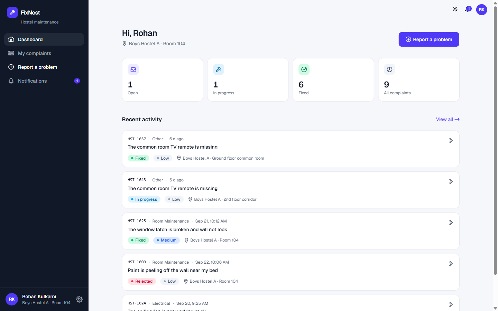<br>**Dashboard**: what is open, in progress and fixed | 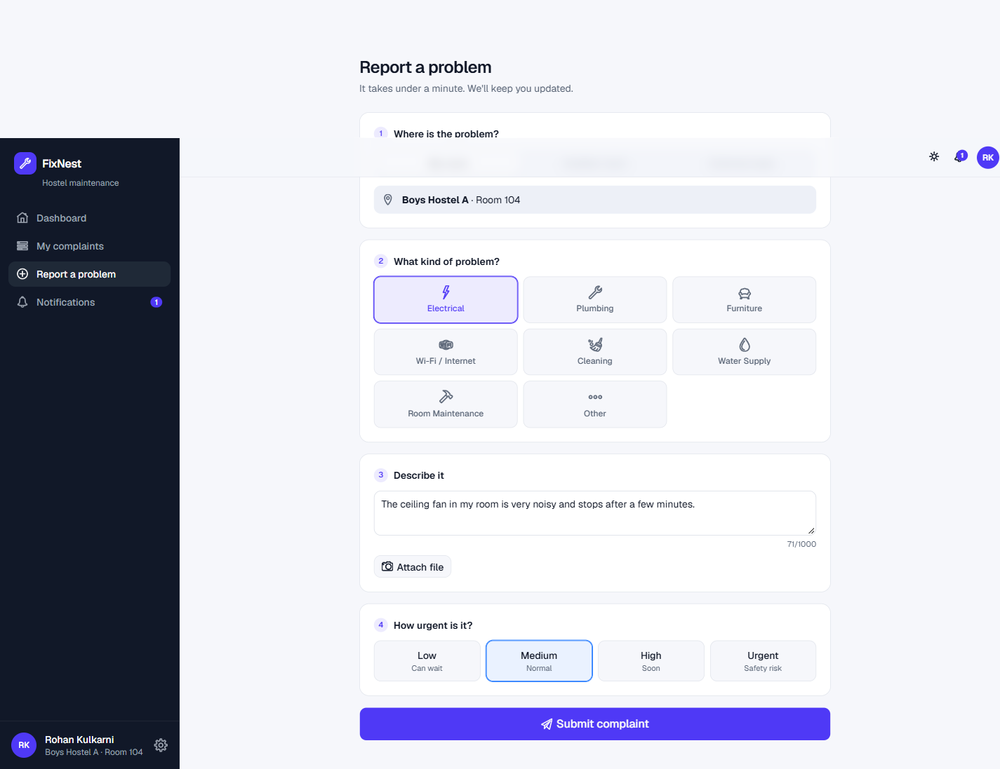<br>**Report a problem** in four short steps, with an optional photo or video |
| 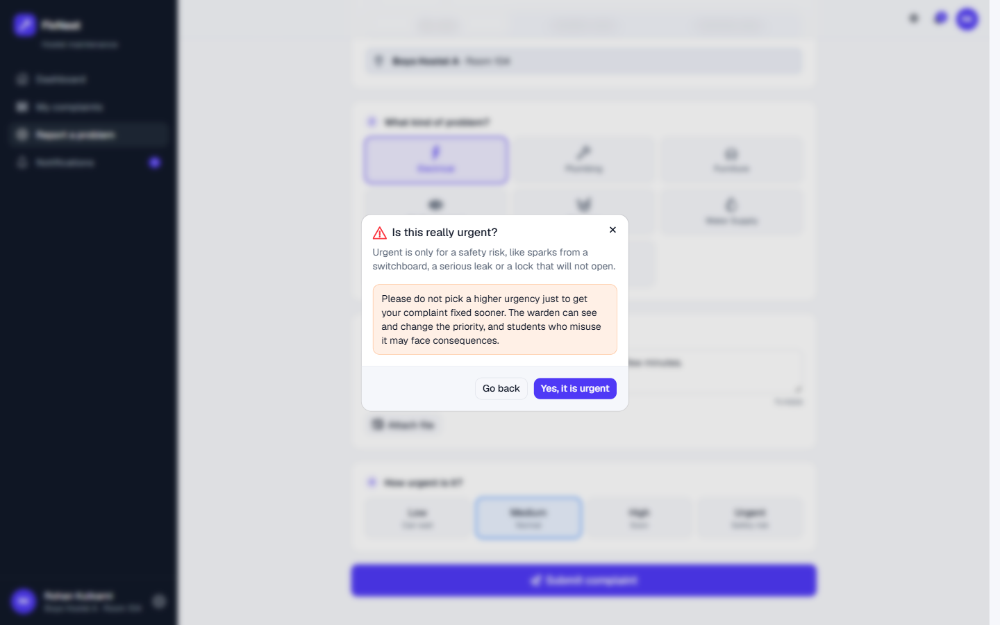<br>**High and Urgent ask "are you sure?"** so nobody games the queue | 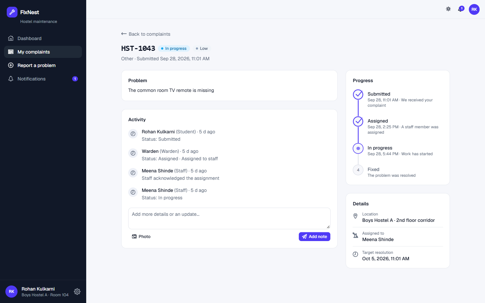<br>**Follow every complaint** from submitted to fixed, with notes |
| 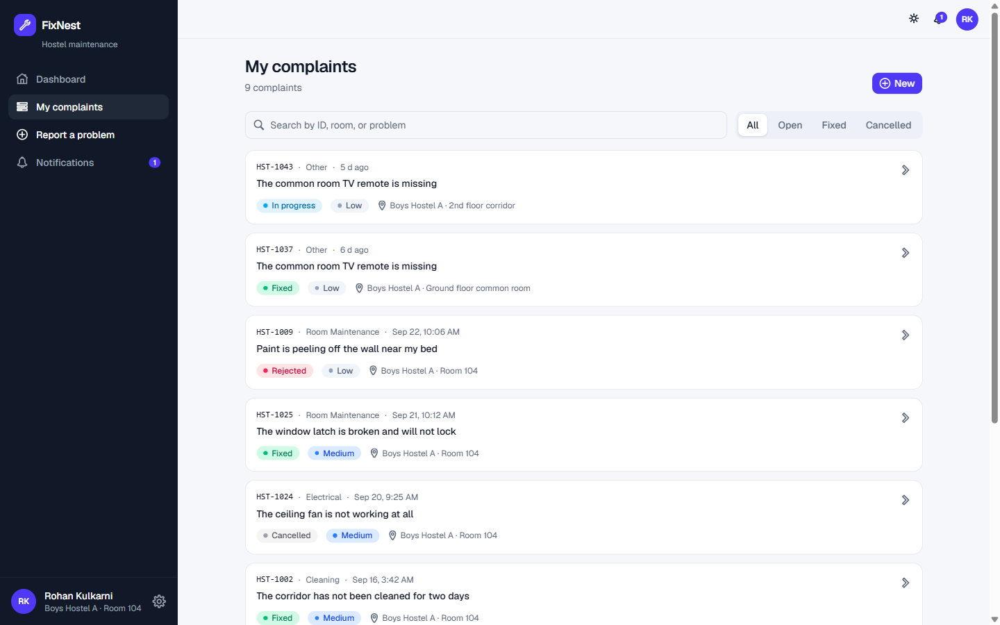<br>**My complaints**, newest first | 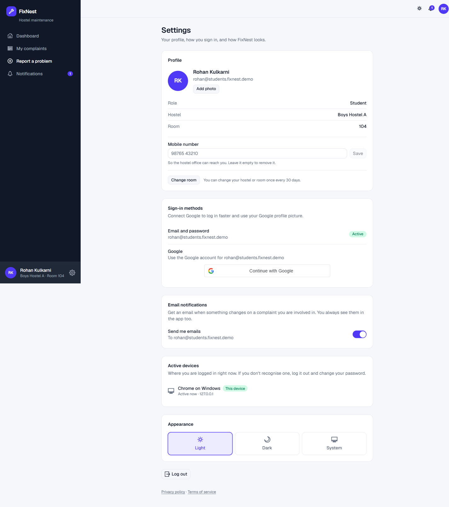<br>**Settings**: profile picture, mobile number, change room, Google, active devices |

### For maintenance staff and the admin

| | |
|---|---|
| 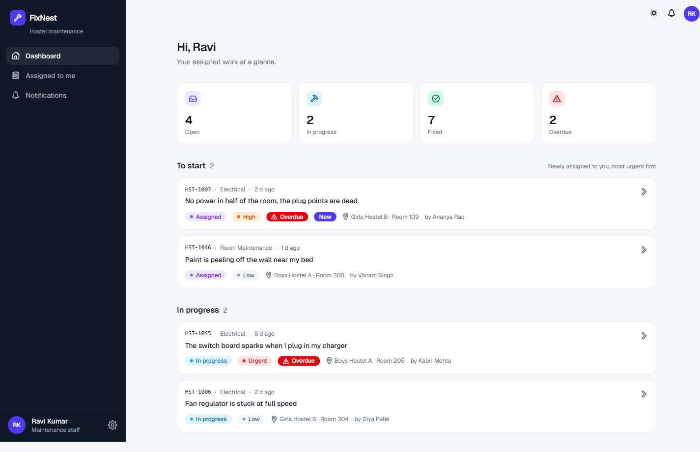<br>**Staff work queue**: what is broken, where, and how urgent | 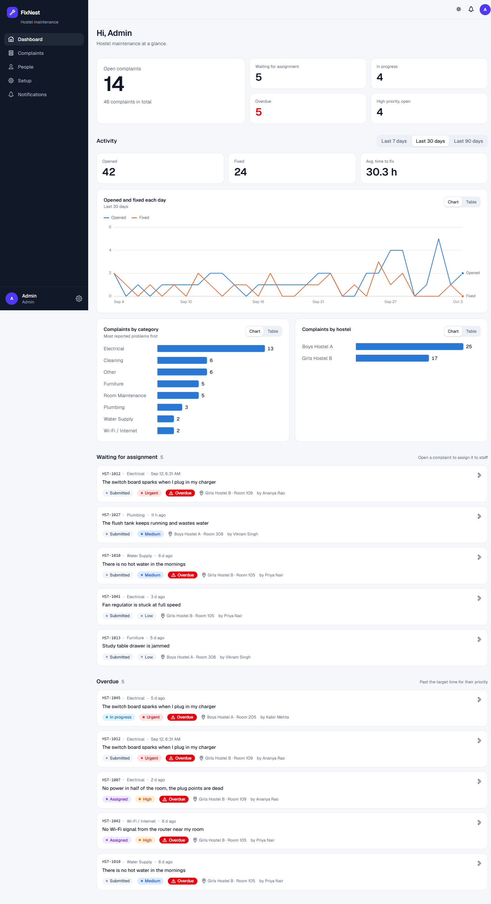<br>**Admin dashboard**: totals, overdue, average fix time, charts |
| 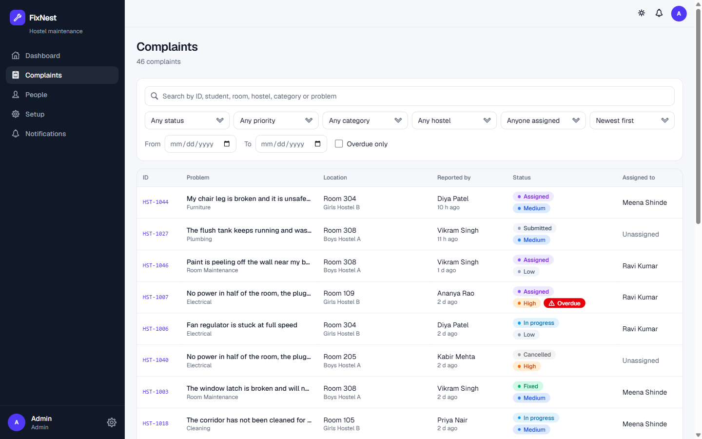<br>**All complaints** with search, filters and sorting | 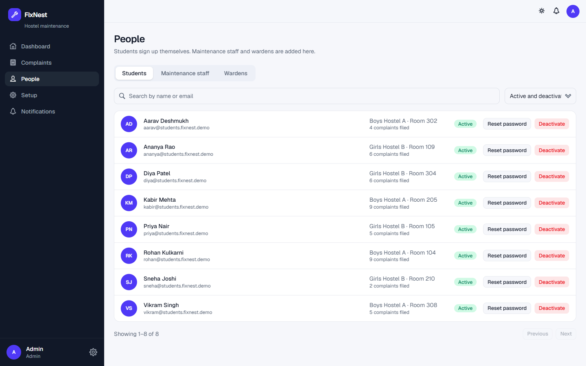<br>**People**: students, staff and wardens |
| 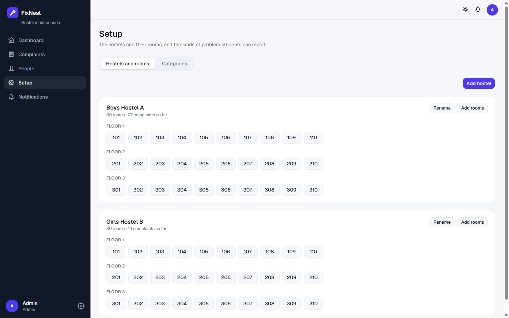<br>**Setup**: hostels, rooms and categories | 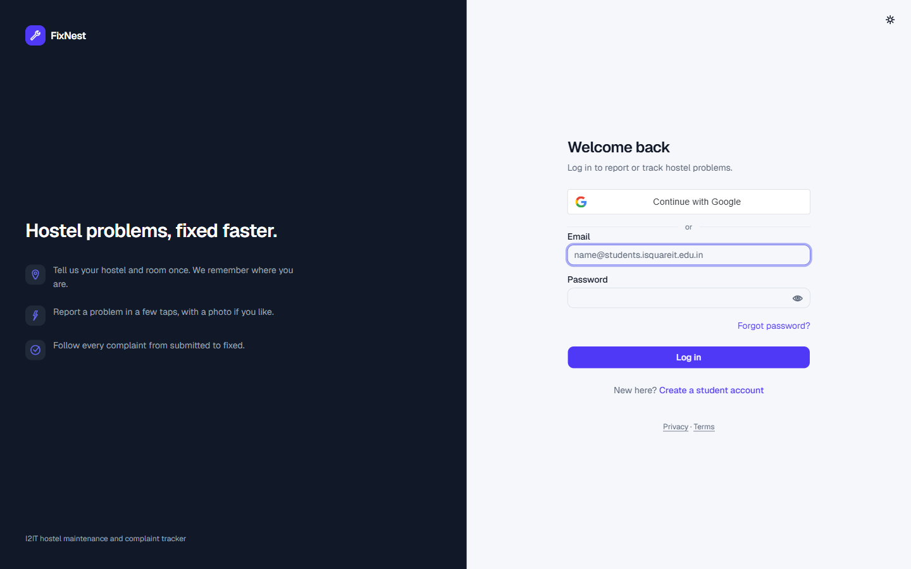<br>**Sign in** with a college email or Google |

### Dark mode and phones

| | | | |
|---|---|---|---|
| 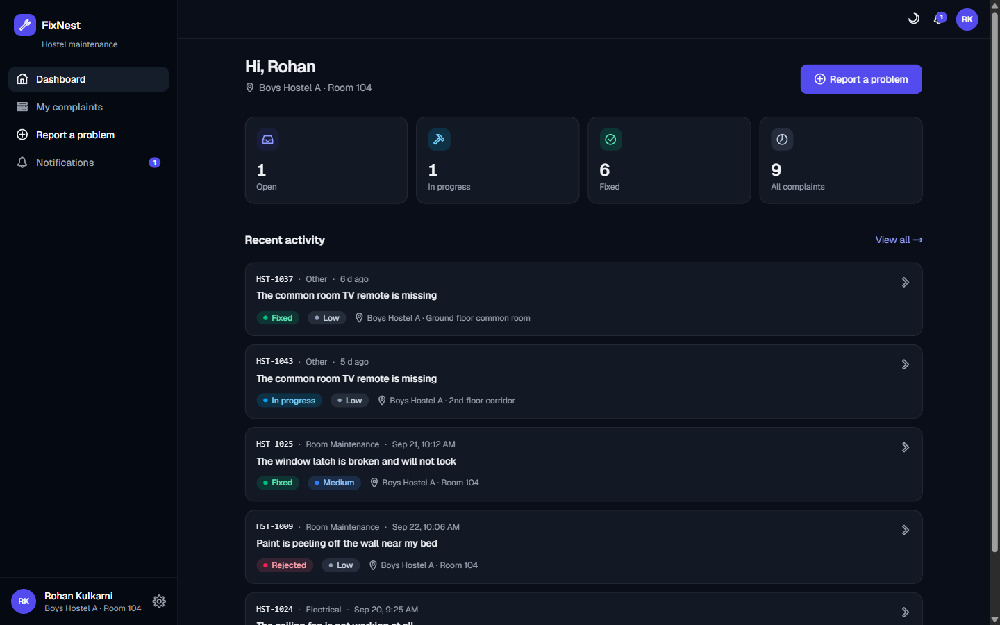 | 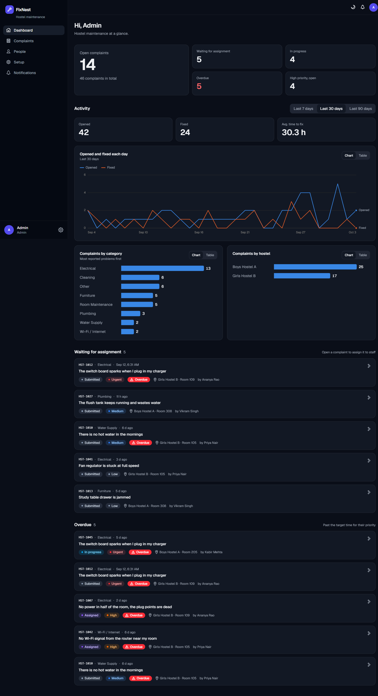 | 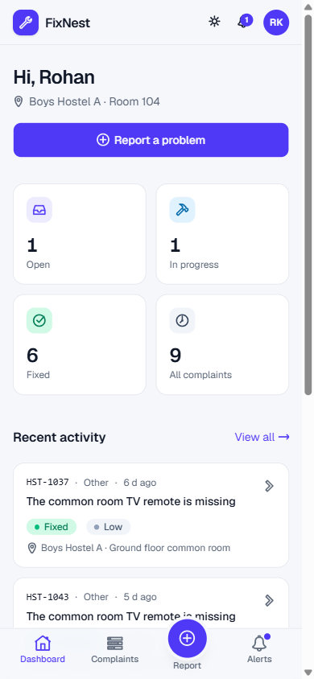 | 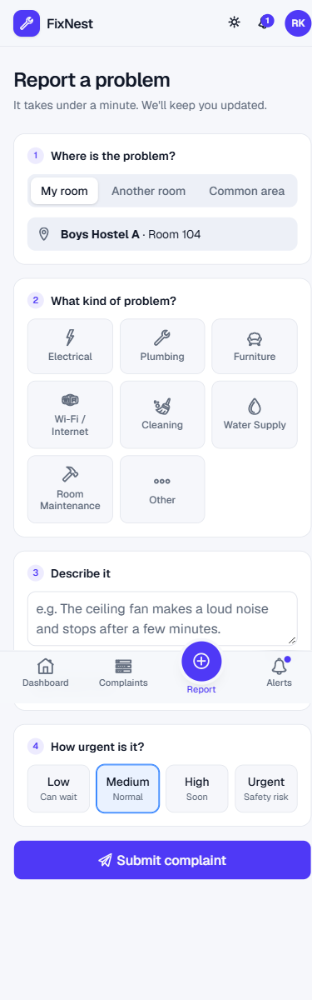 |
| Dark mode, student | Dark mode, admin | On a phone | Report form on a phone |

## Features

| | Student | Staff | Warden | Admin |
|---|:-:|:-:|:-:|:-:|
| Sign up with a college email (emailed code) or Google | ✓ | | | |
| Log in with email and password, or Google | ✓ | ✓ | ✓ | ✓ |
| Forgot password: emailed one-time reset link | ✓ | ✓ | ✓ | ✓ |
| A welcome email when a student's account is ready (designed HTML, with a plain-text twin) | ✓ | | | |
| Email notifications on every update (can be switched off in Settings) | ✓ | ✓ | ✓ | ✓ |
| Report a problem: location, category, description, photo or short video, priority (High and Urgent ask "are you sure?" first) | ✓ | | | |
| Type your own hostel name and room number (letters allowed, like M423) | ✓ | | | |
| Change your hostel or room (once every 30 days) | ✓ | | | |
| Upload or remove your own profile picture | ✓ | ✓ | ✓ | ✓ |
| Add a mobile number (not verified) | ✓ | ✓ | ✓ | ✓ |
| See where you are logged in, and log a device out | ✓ | ✓ | ✓ | ✓ |
| Track status, timeline, and notifications | ✓ | | | |
| Cancel a complaint (before work starts) or reopen a fixed one (within 7 days) | ✓ | | | |
| Work queue, acknowledge, start work, progress notes, mark fixed with proof photo | | ✓ | ✓ | ✓ |
| Dashboard with totals, overdue, average fix time, and charts | | | ✓ | ✓ |
| Search, filter (status, priority, category, hostel, staff, dates) and sort all complaints | | | ✓ | ✓ |
| Assign to staff, change priority, reject with a reason | | | ✓ | ✓ |
| Manage students and staff (add, deactivate, reset password) | | | ✓ | ✓ |
| Manage wardens | | | | ✓ |
| Manage hostels, rooms, categories | | | | ✓ |
| Light, dark or system theme; works on phone, tablet and desktop | ✓ | ✓ | ✓ | ✓ |

**Nobody can delete a complaint**, not even an admin. Complaints can be cancelled, rejected or fixed, and every change is
kept in the timeline. A hostel or room that has complaints cannot be removed either.

**Complaint lifecycle:** Submitted → Assigned → In progress → Fixed. A complaint can also be *Rejected* (by the warden,
with a reason) or *Cancelled* (by the student). Every change is recorded in a timeline and triggers an in-app
notification. Each priority has a target time, and complaints past it are flagged **Overdue**:
Urgent 24 h, High 48 h, Medium 72 h, Low 7 days.

## Tech stack

| Part | Choice |
|---|---|
| Server | Node.js 24, Express 5, TypeScript |
| Database | SQLite (built into Node 24 as `node:sqlite`), plain SQL migrations |
| Validation | Zod, on every request |
| Auth | Password (bcrypt) or Google, JWT in an `httpOnly` cookie |
| Web app | React 19, Vite, TypeScript, Tailwind CSS v4, React Router, TanStack Query |
| UI | shadcn/ui (Base UI) components, Icons8 icons, charts built for this project |
| Tests | Node's built-in test runner (`node:test`): 201 tests |

SQLite is a deliberate choice: one hostel means one small, easy-to-back-up file with no database server to run.

## Quick start (development)

You need **Node.js 24 or newer** (`node -v`).

```bash
npm install
```

Create the server settings file and put a random secret in it:

```bash
cp server/.env.example server/.env
node -e "console.log(require('crypto').randomBytes(48).toString('hex'))"
```

Paste the printed value after `JWT_SECRET=` in `server/.env`. Then load the demo data and start everything:

```bash
npm run seed
npm run dev
```

- Web app: <http://localhost:5173>
- API: <http://localhost:3001> (the web app forwards `/api` to it)

The database file (`server/hostel.db`) and its tables are created automatically on first start.

### Demo accounts

`npm run seed` creates hostels, rooms, categories, people, and about 45 realistic complaints. Every demo account uses the
password **`Demo@1234`**.

| Role | Email |
|---|---|
| Admin | `admin@fixnest.demo` |
| Warden | `warden@fixnest.demo` |
| Staff | `ravi.staff@fixnest.demo` (electrician), `sunil.staff@fixnest.demo` (plumber), `meena.staff@fixnest.demo`, `imran.staff@fixnest.demo` |
| Student | `aarav@students.fixnest.demo`, `rohan@…`, `sneha@…`, `priya@…`, `kabir@…`, `vikram@…`, `ananya@…`, `diya@…` |

The seed script refuses to run when `NODE_ENV=production`. **Never load demo accounts on a real deployment.**
Running it again is safe: it adds only what is missing.

While developing, verification codes are **printed in the server console** instead of being emailed.

## Settings (`server/.env`)

| Variable | What it does |
|---|---|
| `JWT_SECRET` | Signs login sessions. A long random string. Required in production (32+ characters). |
| `APP_URL` | The address people use to open the web app. Used for the links in emails and to reject cross-site requests. |
| `PORT` | API port (default 3001). |
| `DB_PATH` | Where the SQLite file lives (default `./hostel.db`). |
| `UPLOAD_DIR` | Where photos are stored (default `./uploads`). |
| `STUDENT_EMAIL_DOMAINS` | Comma-separated domains allowed to self-register as students (default `students.isquareit.edu.in`). |
| `GOOGLE_CLIENT_ID` | Turns on Google sign-in (see below). Leave empty to hide the button. |
| `SMTP_HOST`, `SMTP_PORT`, `SMTP_USER`, `SMTP_PASS`, `SMTP_FROM` | Outgoing email (verification codes, password resets, notifications). Required in production. |
| `TRUST_PROXY` | Number of reverse proxies in front of the server (0 if none). Needed for correct rate limiting behind one. |
| `CLIENT_DIST` | Where the built web app is (default `../client/dist`). |
| `RATE_LIMIT_AUTH` | Sign-in requests per 15 minutes per address (default 60). |
| `NODE_ENV` | `production` turns on secure cookies, the strict content policy, and serves the built web app. |

## Commands

| Command | What it does |
|---|---|
| `npm run dev` | Starts the API and the web app with live reload. |
| `npm run seed` | Adds demo data (development only). |
| `npm test` | Runs the server test suite. |
| `npm run typecheck` | Type-checks both the web app and the server. |
| `npm run build` | Builds the web app into `client/dist`. |
| `npm start` | Starts the server (in production it also serves the built web app). |
| `npm run create-admin -w server -- "Name" email@example.com` | Creates or promotes an admin account. Needs `ADMIN_PASSWORD` (10+ characters) set in the environment. |

## Google sign-in

Students on a college Google account, and existing staff and wardens, can use **Continue with Google**.

- A Google account can sign in to an **existing** FixNest account with the same verified email.
- A **new** account is only created for a student-domain email, and only as a student. Google never creates staff or
  wardens.
- Anyone who signed up with email can connect Google later in **Settings**.

To turn it on:

1. In the [Google Cloud Console](https://console.cloud.google.com), create a project and set up the OAuth consent screen
   (audience **External**; add test users while it is in *Testing* mode).
2. Create an **OAuth client ID** of type **Web application**. Under *Authorized JavaScript origins* add your web address
   (`http://localhost:5173` for development, your real address for production). Leave redirect URIs empty.
3. Put the client ID in `server/.env` as `GOOGLE_CLIENT_ID=…` and restart the server. The client secret is not needed.

## Email

FixNest sends three kinds of email: the **verification code** when a student signs up, the **password reset link**, and
**notifications** (assigned, work started, fixed, and so on).

- **The welcome email** goes to a new student once, when their account becomes usable (email code confirmed, or Google
  sign-up finished). It is a designed email with the FixNest logo inside it, their hostel and room, three steps for using
  FixNest, and a safety note. Plain-text mail apps get a text version. It is sent in the background, so a mail problem
  never stops a sign-up. See it without registering anyone: `npm run welcome-preview -w server` writes
  `welcome-preview.html`; add an address (`-- you@example.com`) to send it for real.
- **Notifications** are queued and sent in the background every few seconds, so a slow mail server never slows down the
  app. A failed send is retried (after 2, 4, 6 and 8 minutes) before giving up, and nothing is lost if the server
  restarts mid-way.
- Everyone can switch notification emails off in **Settings**. The in-app notification always appears. A person's own
  actions (like the receipt for a complaint they just filed) are in the app only.
- **Password resets** use a one-time link that expires after 30 minutes. It carries its secret after the `#`, which
  browsers never send to servers. Only a hash is stored. Using it signs the person out of every device, and asking for
  a link never reveals whether an address has an account.
- In **development**, with no `SMTP_*` settings, every email is printed in the server console instead of being sent.
  In **production** without SMTP, nothing is ever printed (that would leak codes into the logs); sending simply fails
  and the server warns you at startup.
- The sign-up code is 6 digits, valid for 10 minutes, allows 5 tries, and can be re-sent once a minute.

### Turning on real email

Any SMTP account works. The settings go in `server/.env` (never in chat, never in git):

| Setting | Gmail example |
|---|---|
| `SMTP_HOST` | `smtp.gmail.com` |
| `SMTP_PORT` | `465` |
| `SMTP_USER` | the Gmail address |
| `SMTP_PASS` | a 16-character **App Password** (Google Account → Security → 2-Step Verification on → App passwords) |
| `SMTP_FROM` | `FixNest <the same Gmail address>` |

Restart the server, then check it before anyone signs up:

```bash
npm run test-mail -w server -- you@example.com
```

Gmail is fine for trying things out (about 500 emails a day). For the live site, use a mail service on your own domain
(for example Resend or Brevo), add the SPF and DKIM records it gives you in the domain's DNS settings, and set
`SMTP_FROM` to an address on that domain. Without those records, mail to college inboxes tends to land in spam.

**Using your registrar's mailbox (Titan)** also works and gives you a real `support@your-domain.example` inbox to receive replies:
use `smtp.titan.email`, port `465`, the full address as the login, and the mailbox password. On the live server, run
`deploy/set-smtp.sh` (see DEPLOY.md): it asks for the password with hidden typing and sends a test email. Mailboxes have a
daily sending limit, so if you ever outgrow it, switch to a sending service below.

A sending service only *sends*. To receive replies at an address like `support@your-domain.example`, forward it to an inbox you
read, or create a mailbox for it.

| Setting | Resend | Brevo |
|---|---|---|
| `SMTP_HOST` | `smtp.resend.com` | `smtp-relay.brevo.com` |
| `SMTP_PORT` | `465` | `587` |
| `SMTP_USER` | `resend` | your Brevo login email |
| `SMTP_PASS` | an API key with "sending access" | an SMTP key from the Brevo dashboard |
| `SMTP_FROM` | `FixNest <support@your-domain.example>` (domain must be verified) | same |

## Testing on a phone

During development, set `APP_URL` to your computer's address on the local network (for example
`http://192.168.1.20:5173`) in `server/.env`, restart the server, and open that address on the phone. `APP_URL` must match
the address in the phone's browser exactly, or sign-in requests are refused.

## Project layout

```
server/                  Express API
  src/routes/            auth, complaints, admin, stats, notifications, files, ...
  src/services/          complaints, notifications, mailer, Google, uploads, login guard
  src/middleware/        sessions, roles, error handling
  src/db/                connection, migrations/*.sql, seed and demo data
  src/tests/             automated tests
client/                  React web app
  src/pages/             student, staff and admin/ screens
  src/components/        shared UI (charts, status timeline, dialogs, ...)
  src/assets/icons8/     the SVG icons
ROADMAP.md               the build plan and decisions
```

## Security

- **Roles are enforced on the server.** Students see only their own complaints, staff only those assigned to them,
  and admin routes reject everyone else. Hiding buttons in the web app is a convenience, not the protection.
  The tests check every endpoint, including that a stranger's complaint looks like it does not exist.
- **Sessions** live in an `httpOnly`, `SameSite=Lax` cookie (with `Secure` in production). A password reset or
  deactivation signs the person out everywhere.
- **Passwords** are hashed with bcrypt. Wrong guesses are limited per address and per account.
- **Sign-up** is limited to college email domains and needs an emailed code (10-minute expiry, 5 tries).
- **Password resets** are single-use, expire in 30 minutes, are stored only as a hash, and never reveal whether an account exists.
- **Uploads** are limited to JPEG, PNG or WebP photos (5 MB), or MP4, MOV or WebM videos (25 MB, on a new complaint only). The real file type is checked from its contents (not its name),
  files get random names, and they are served only to people allowed to see that complaint. The web app strips hidden
  camera data (including GPS location) from photos before uploading. Videos are stored exactly as recorded (they
  cannot be cleaned in the browser), so a phone may leave its location inside one.
- **Upload bursts** cannot fill the server's memory: one upload at a time per person, and only a few at once overall.
- **Devices:** every login is recorded, so it can be listed and logged out. A live site refuses logins that were not recorded.
- **Requests** are validated with Zod, database queries are parameterised, and writes from other websites are rejected.
- **Production** serves the app with a strict Content-Security-Policy, refuses to start with a weak `JWT_SECRET`, and
  never writes verification codes to the logs.
- `npm audit --omit=dev` (everything that runs on the server) reports no known vulnerabilities at the time of writing. The build tools used on a developer PC are checked separately and can lag behind.

## Going live

The full step-by-step guide (an Azure server, Caddy for HTTPS, systemd, email, backups, updating) is in
**[DEPLOY.md](DEPLOY.md)**, with ready-made files in `deploy/`. In short:

1. Put the code on the server (Node 24+), then `npm ci` and `npm run build`.
2. Create `server/.env` from `deploy/env.production.example`: a strong `JWT_SECRET`, your real `APP_URL` (**https**),
   `SMTP_*` settings, `GOOGLE_CLIENT_ID`, and `TRUST_PROXY=1` behind a reverse proxy. In production the app listens
   only on the same machine (`HOST` defaults to `127.0.0.1`), so a web server such as Caddy must sit in front of it.
3. Create the first admin: `ADMIN_PASSWORD='a-long-password' npm run create-admin -w server -- "Your name" you@college.edu`. The admin adds wardens under **People → Wardens**.
4. Start with `npm start` under a process manager (systemd, pm2, or your host's runner). Put HTTPS in front of it.
5. **Back up** every night with `npm run backup -w server` (database and photos, keeps 14 days; the cron file is in `deploy/`).

## Known limits

- There is no self-service "change password" screen for someone who is already logged in (use **Forgot password**,
  which works at any time).
- Notifications are in-app and email. Push notifications could be added in one place (`server/src/services/notify.ts`).
- Login lockout counters are held in memory, so they reset if the server restarts.
- SQLite handles one server process well. If the hostel ever grows past that, the schema moves to Postgres cleanly.

## Credits

Icons by [Icons8](https://icons8.com). Interface components from shadcn/ui.
